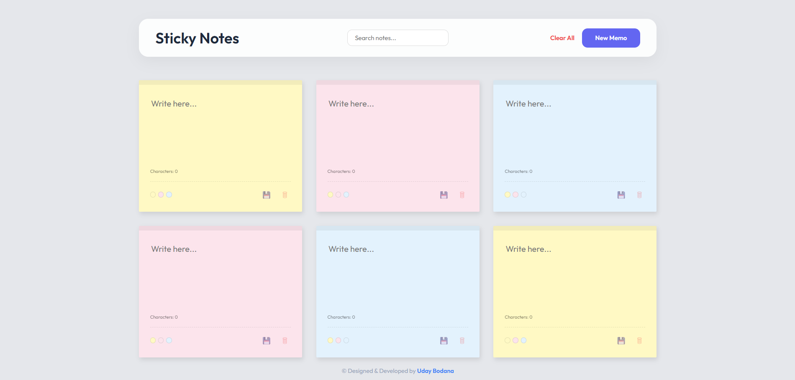

# 📌 Sticky Notes

A sleek, premium, and highly interactive digital canvas for sticky notes. Instantly create, customize colors, edit text, and delete notes dynamically on a modern note board.

---

## ✨ Features

- **Quick-Add Notes:** One-click dynamic creation of interactive sticky note cards.
- **Vibrant Color Customization:** Instantly change note colors (Yellow, Pink, Blue) to categorize tasks visually.
- **On-Screen Content Editing:** Edit text content in real time via responsive textarea fields.
- **Persistent Notes:** Retains all your custom notes and colors across page reloads using `localStorage`.
- **Premium Board UX:** Subtle glassmorphism, responsive hover states, smooth shadows, and modern fonts.

---

## 🚀 How to Use

1. **Create Note:** Tap the add button to generate a new sticky note card.
2. **Edit Text:** Type your notes and reminders directly into the text area.
3. **Customize Background:** Select a predefined color to match your task or theme.
4. **Delete:** Click the delete button on any note to remove it instantly.

---

## 💻 Tech Stack

- **HTML5**
- **CSS3**
- **JavaScript**

---

## 🏃 How to Run

1. Clone or download this repository.
2. Open `index.html` directly in any web browser, or use a local development server like **Live Server** in VS Code.

---

## 📸 Preview

---

© Designed & Developed by **Uday Bodana**